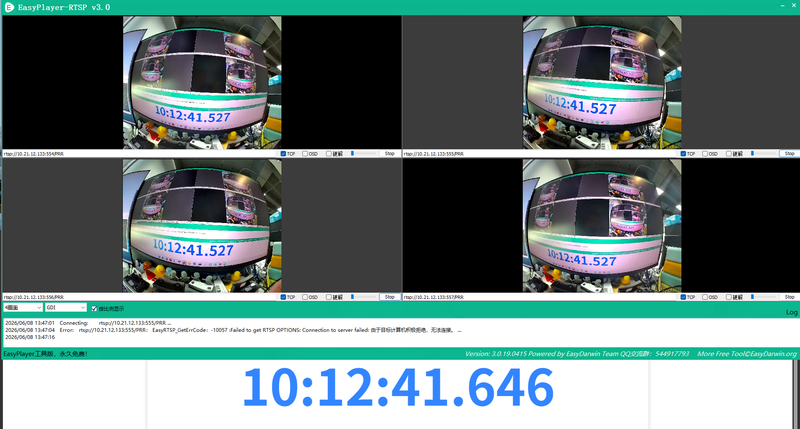
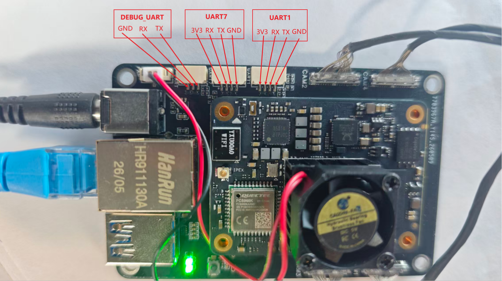

# X5 SC132 4-Camera, IMU And UART Open Source Demo

English version: [README_EN.md](README_EN.md)


这是给用户交付的最小开源 demo。它包含 SC132 四目相机 RTSP 示例、IMU 读取示例、串口通信示例、公开头文件和二进制驱动库，不包含底层驱动实现源码。

## 1. 目录结构

```text
open_source_demo/
├── CMakeLists.txt
├── README.md
├── README_EN.md
├── include/
│   ├── icm42688_driver.h
│   ├── sc132camera.h
│   └── pr_venc.h
├── lib/
│   ├── libicm42688.so
│   ├── libsc132.so
│   └── libprrtsp.so
├── scripts/
│   ├── build_cam_demo.sh
│   ├── build_imu_reader_demo.sh
│   ├── build_serial_port_demo.sh
│   └── package_runtime.sh
└── src/
    ├── cam_demo.cpp
    ├── cam_demo_common.h / cam_demo_common.cpp
    ├── cam_demo_config.h / cam_demo_config.cpp
    ├── cam_demo_pipeline.h / cam_demo_pipeline.cpp
    ├── cam_demo_rtsp.h / cam_demo_rtsp.cpp
    ├── imu_reader_demo.cpp
    └── serial_port_demo.cpp
```

`cam_demo.cpp` 保留主流程和用户二次开发入口；配置解析、RTSP 封装、帧队列和后台推流流程分别拆到 `cam_demo_config.*`、`cam_demo_rtsp.*`、`cam_demo_pipeline.*`，便于用户按模块阅读。

## 2. 构建

本 demo 设计为“开发机交叉编译，X5 板端只运行”，不要求也不建议在 X5 板端原生编译。

构建前需要准备：

- X5 aarch64 交叉编译工具链
- CMake
- X5 SDK 提供的 toolchain file

下面命令中的 toolchain file 路径仅为本机示例，用户需要替换成自己环境里的实际路径：

```bash
cd open_source_demo
cmake -S . -B build_x5 \
  -DCMAKE_TOOLCHAIN_FILE=/path/to/aarch64_x5_host_toolchain.cmake
cmake --build build_x5 -j
```

也可以只编译单个 demo：

```bash
TOOLCHAIN_FILE=/path/to/aarch64_x5_host_toolchain.cmake scripts/build_cam_demo.sh
TOOLCHAIN_FILE=/path/to/aarch64_x5_host_toolchain.cmake scripts/build_imu_reader_demo.sh
TOOLCHAIN_FILE=/path/to/aarch64_x5_host_toolchain.cmake scripts/build_serial_port_demo.sh
```


生成文件：

- `build_x5/imu_reader_demo`
- `build_x5/serial_port_demo`
- `build_x5/cam_demo`

检查架构：

```bash
file build_x5/imu_reader_demo
file build_x5/serial_port_demo
file build_x5/cam_demo
file lib/libicm42688.so
file lib/libsc132.so
file lib/libprrtsp.so
```

期望输出包含 `ARM aarch64`。

如果没有交叉编译工具链，则不能重新编译 demo，只能使用已经编译好的 `imu_reader_demo`、`serial_port_demo`、`cam_demo` 和 `lib/` 下对应 `.so` 部署到板端运行。

## 3. 部署

主仓库集成时，`sub_module/RoboBaton_4p_demo/demo/` 是随仓库分发的板端运行包；单独查看本仓库时，对应运行包就是当前仓库的 `demo/`。用户可以直接把 `demo/` 的内容复制到 X5 的 `/root/demo/` 作为更新包。

> 当前仓库状态提示：`demo/` 已由最新 C ABI v2 可执行文件和三套 SO 重新生成，并通过 `scripts/verify_runtime_package.py` 与 `manifest.sha256` 开发机校验。该结果只证明 AArch64 构建、ABI 版本和包内哈希一致；X5 目标板 `ldd/--help/IMU/相机/RTSP` smoke 尚未执行，不能标记为实机发布完成。

代码或动态库变更后，维护者先在开发机重新构建依赖库并刷新 `demo/`：

```bash
cd <4cam-repo-root>/sub_module/RoboBaton_4p_demo
scripts/package_runtime.sh
```

`scripts/package_runtime.sh` 是完整发布入口：先从顶层权威源码干净重编译
`libicm42688`、`libsc132`、`libprrtsp` 并同步到 `./lib`，然后删除并重建
`./build_x5`、编译仓库 CMake 声明的全部 demo target，最终原子发布并验证 `./demo`。

运行包包含顶层启动脚本、`env.sh`、`bin/` 和 `lib/`。部署时请完整拷贝 `demo/` 的内容到板端，不要只拷贝单个可执行文件或单个 `.so`。

部署到 X5：

```bash
ssh root@<x5-ip> "rm -rf /root/demo && mkdir -p /root/demo"
tar -C demo -cf - . | ssh root@<x5-ip> "tar -xf - -C /root/demo"
ssh root@<x5-ip> "chmod +x /root/demo/cam_demo /root/demo/imu_reader_demo /root/demo/serial_port_demo /root/demo/bin/*"
```

注意：这里复制的是 `demo/` 目录里的内容，不是把外层 `demo/` 目录整体复制到板端；板端不应出现 `/root/demo/demo/`。

板端目录结构：

```text
/root/demo/
├── cam_demo
├── imu_reader_demo
├── serial_port_demo
├── env.sh
├── bin/
│   ├── cam_demo
│   ├── imu_reader_demo
│   └── serial_port_demo
└── lib/
    ├── libicm42688.so
    ├── libsc132.so
    └── libprrtsp.so
```

默认运行方式：

```bash
cd /root/demo
./cam_demo
./imu_reader_demo
./serial_port_demo
```

顶层 `cam_demo`、`imu_reader_demo`、`serial_port_demo` 是启动脚本，会先设置：

```bash
LD_LIBRARY_PATH=/root/demo/lib:/usr/hobot/lib:/usr/hobot/lib/sensor:/usr/lib:/lib64:/lib
```

真实 ELF 在 `bin/` 下。如果要直接运行 `bin/` 下的 ELF，需要先加载环境：

```bash
cd /root/demo
. ./env.sh
./bin/cam_demo
```

三个 demo 都带有默认配置，普通功能验证时直接执行顶层脚本即可。需要修改帧率、码率、串口号或采样次数时，再通过命令行参数覆盖默认值。

## 4. SC132 四目相机 RTSP Demo

`cam_demo` 演示如何同时使用：

- `libsc132.so`：启动 SC132 四目相机，并通过 frame-set callback 获取配组后的 NV12 DMA 帧
- `libprrtsp.so`：把四路 NV12 帧送入 X5 编码器并输出 RTSP

三个 demo 可执行文件已经按 X5 运行环境链接。请保持 `cam_demo`、`include/` 和 `lib/` 中的二进制库来自同一份运行包；不要混用系统目录或其他工程里的同名 `.so`，否则可能出现启动失败或运行时符号不匹配。

默认运行：

```bash
./cam_demo
```

当前 X5 镜像依赖系统 `cam-service` 初始化 camera/ISP 基线；运行 demo 前先确认该服务存在，不要同时运行多个相机应用：

```bash
/etc/init.d/S90cam-service start 2>/dev/null || true
pgrep -a cam-service
killall -q cam_demo 2>/dev/null || true
```

`--trigger-mode` 默认值是 `software_gpio`，对应当前四目相机外触发接线。普通交付运行直接执行 `./cam_demo`，默认启动固定四路、60fps、正装方向 `1280x1088` 输出。

部署时请整目录拷贝 `/root/demo` 运行包。顶层入口会设置 `LD_LIBRARY_PATH`，如果只拷贝 `bin/cam_demo` 或单个 `.so`，板端可能加载系统库，导致运行环境和交付包不一致。

常用参数：

```text
--width <pixels>   图像宽度，默认 1280
--height <pixels>  图像高度，默认 1088
--fps <30|60>      相机和编码帧率，默认 60
--rotate <0|90|180|270> 输出旋转角度，默认 0；180 仅支持 30fps，不支持 60fps
--bps <kbps>       编码目标平均码率，单位 kbps，默认 4000；H.264 + P 帧 GOP 运动画质基线，可按带宽/画质折中覆盖
--url <path>       RTSP path，默认 /PRR
--trigger-mode <software_gpio|vin_lpwm|none> 触发输出模式，默认 software_gpio/GPIO417
--diagnostics      输出每路送帧耗时和时间戳 skew 诊断信息
--max-skew-ns <ns> 帧组 timestamp skew 放行上限，默认 2000000；同步配组后四路 frame_id 对外保持绝对一致
--frame-timeout-ms <ms> 帧组等待缺路帧的超时时间，默认 100
```

限制说明：默认 `./cam_demo` 使用固定四路、60fps、正装方向 `1280x1088` 输出。`--rotate 180` 仅支持 30fps 降载模式，不支持 60fps。

默认四路 RTSP 地址：

```text
rtsp://<x5-ip>:554/PRR
rtsp://<x5-ip>:555/PRR
rtsp://<x5-ip>:556/PRR
rtsp://<x5-ip>:557/PRR
```

默认 RTSP 端口固定为 `554/555/556/557`。camera 0/1/2/3 分别对应四路输出，交付例程不提供端口重映射参数。

### 4.1 硬件检测：单颗 sensor 取图

当四目整体启动失败、某一路无图、怀疑 FPC/接口/I2C/MIPI 连接异常时，可以只启动单颗 sensor 做硬件排查。该模式只用于检测单颗 sensor 和连接状态；正常运行仍直接执行 `./cam_demo` 启动四路。

测试前先停止其他相机进程：

```bash
cd /root/demo
killall -q cam_demo 2>/dev/null || true
/etc/init.d/S90cam-service start 2>/dev/null || true
```

板端按物理 camera id 启动单颗 sensor：

```bash
./cam_demo --camera-id 0 --diagnostics   # cam0 -> rtsp://<x5-ip>:554/PRR
./cam_demo --camera-id 1 --diagnostics   # cam1 -> rtsp://<x5-ip>:555/PRR
./cam_demo --camera-id 2 --diagnostics   # cam2 -> rtsp://<x5-ip>:556/PRR
./cam_demo --camera-id 3 --diagnostics   # cam3 -> rtsp://<x5-ip>:557/PRR
```

每次只运行一个 `cam_demo`。切换到下一颗 sensor 前，先按 `Ctrl-C` 退出当前进程，或执行：

```bash
killall -q cam_demo 2>/dev/null || true
```

开发机用 `ffprobe` 或播放器拉流确认是否出图；下面以 cam0 为例，其他 sensor 替换端口 `555/556/557`：

```bash
ffprobe -v error -rtsp_transport tcp \
  -select_streams v:0 \
  -show_entries stream=codec_name,width,height,avg_frame_rate \
  -of default=noprint_wrappers=1 \
  rtsp://<x5-ip>:554/PRR
```

正常输出应包含：

```text
codec_name=h264
width=1280
height=1088
avg_frame_rate=60/1
```

判定建议：

- 板端日志出现 `Found sensor_name:sc132gs-1280p`，且 `ffprobe` 能读到 H.264 码流，说明该 sensor、I2C、MIPI/VIN 和 RTSP 链路基本正常。
- 只有某个 `--camera-id` 失败时，优先检查对应 camera 接口、FPC、供电和连接方向。
- 四颗单独都能出图但默认四路失败时，优先检查四路同步触发、GPIO417 外触发线、`cam-service` 状态和是否有其他相机进程占用资源。

单颗诊断模式只支持 `--camera-id 0/1/2/3`；不要用该模式判断 2 路或 3 路组合能力。

相机回调后的处理流程：

1. `cam_demo` 通过 `libsc132.so` 的 frame-set API 注册四目同步 callback。
2. `libsc132.so` 对四路相机帧做同步配组，配组成功后回调给 demo。
3. demo 在帧组回调里调用用户入口，并给每路 frame `retain` 后放入对应 RTSP 队列。
4. 队列满时等待后台线程释放空槽，不丢弃旧帧。
5. 后台线程从队列取帧，调用对应 `Rtsp_SendImg*_planes()` 推流。
6. 后台线程处理完成后调用 `sc132_frame_release()` 归还帧。

用户二次开发的四目同步入口在 `src/cam_demo.cpp` 的 `OnSynchronizedFrameSet()`。该函数收到的是同一个 `group_id` 下的四路帧，包含 `max_skew_ns`、每路 `camera_id`、`sequence`、`frame_id` 和 `timestamp_ns`；`libsc132.so` 仅在归一化 `frame_id` 一致且 timestamp skew 不超过配置上限时放行，默认上限 `2000000 ns` 覆盖 30fps 板端实测约 `1.06 ms` 的同帧链路相位差，同时仍远小于一帧周期。不要把裸指针保存到更长生命周期；如果要异步使用图像，请自行 `sc132_frame_retain()`，处理完成后 `sc132_frame_release()`。

日志字段：

- `seq`：每个相机通道独立递增的软件序号
- `group_id`：`libsc132.so` 生成的四目同步帧组序号
- `group_skew_ns`：当前帧组四路 timestamp 最大差值，单位 `ns`，用于诊断链路相位差
- `frame_id`：同步帧组帧号；同一 `group_id` 下四路该值必须完全一致
- `camera_ts_ns`：相机帧时间戳，单位 `ns`；优先为 sensor/VIO 时间戳，fallback 为系统出帧时间
- `enqueue_timestamp_ns`：入队时 host steady clock 时间戳，单位 `ns`
- `full_waits`：队列满时回调等待空槽的次数，正常稳定推流时应长期为 `0`
- `pipeline_delay_ms`：当前帧从入队到完成 RTSP 送帧调用的耗时
- `send_avg_ms` / `send_max_ms`：开启 `--diagnostics` 后输出，表示统计周期内 `Rtsp_SendImg*_planes()` 调用耗时
- `rtsp_latest_skew_ms`：开启 `--diagnostics` 后输出，表示四路最近一次送出的相机时间戳最大差值

## 5. IMU 读取 Demo

默认运行：

```bash
./imu_reader_demo
```

示例：

```bash
./imu_reader_demo --sample-rate-hz 1000 --count 10000
```

默认终端输出频率跟随 `--sample-rate-hz`，即每个 IMU 样本都打印；若需要限速，
可显式设置 `--print-rate-hz`，该值必须不超过 `--sample-rate-hz`。
显式设置为 `0` 时禁用终端输出，但仍消费并计入全部 IMU 样本，`--count` 语义不变。

输出字段：

- `ts_ns`：host monotonic clock 时间戳，单位 `ns`
- `dt_ms`：相邻两个已输出样本的时间戳差，单位 `ms`；默认逐样本输出时代表相邻 IMU 样本周期，1 kHz 下通常约为 `1 ms`
- `temp_c`：温度，单位 `degC`
- `accel_mps2`：三轴加速度，单位 `m/s^2`
- `accel_norm_mps2`：三轴加速度模长，静止时通常接近 `9.81`
- `gyro_rps`：三轴角速度，单位 `rad/s`

说明：

- demo 默认使用 FIFO 模式
- FIFO 模式下，驱动按配置 ODR 展开连续时间戳，用于提供稳定 `dt`
- 当前时间戳不是 FSYNC 外部同步时间戳
- 驱动 callback 运行在采集线程且只负责将样本送入 64 槽有界 FIFO；自定义 observer 与 CLI 输出均在 owner 线程执行
- CLI 默认打印每个 IMU 样本；1 kHz 同步终端输出可能使 FIFO 持续积压，可用较小的 `--print-rate-hz` 主动限速
- 若自定义 observer 的平均处理时间超过采样周期，FIFO 仍会按设计 fail-closed，不会静默丢样

## 6. 串口通信 Demo

接口线序如下：


默认运行：

```bash
./serial_port_demo
```

默认配置使用 `/dev/ttyS1`、`115200`、`txrx` 模式。需要指定端口或模式时再增加参数，例如：

```bash
./serial_port_demo --port /dev/ttyS1 --mode tx --baud 115200 --text "hello-x5"
./serial_port_demo --port /dev/ttyS7 --mode rx --baud 115200
./serial_port_demo --port /dev/ttyS1 --mode txrx --baud 115200 --count 10 --text "ping"
./serial_port_demo --port /dev/ttyS7 --mode echo --baud 115200
```

常用参数：

```text
--port <path>             串口设备，默认 /dev/ttyS1
--baud <rate>             波特率，默认 115200
--mode <tx|rx|txrx|echo>  模式，默认 txrx
--count <n>               tx/txrx 表示发送次数，rx/echo 表示接收包数，0 表示持续运行
--interval-ms <ms>        发送间隔，默认 1000
--timeout-ms <ms>         接收超时，默认 200
--text <str>              发送文本前缀，默认 uart-demo
--no-newline              发送数据末尾不追加换行
```

## 7. 部署后快速验证

部署完成后，建议先确认三个 demo 都能启动帮助信息：

```bash
cd /root/demo
./cam_demo --help
./imu_reader_demo --help
./serial_port_demo --help
```

相机 demo 验证流程：

```bash
cd /root/demo
/etc/init.d/S90cam-service start 2>/dev/null || true
pgrep -a cam-service
./cam_demo
```

启动成功后，用播放器或 RTSP 客户端打开：

```text
rtsp://<x5-ip>:554/PRR
rtsp://<x5-ip>:555/PRR
rtsp://<x5-ip>:556/PRR
rtsp://<x5-ip>:557/PRR
```

基本通过标准：

- 四个 RTSP 地址都能连接并持续出图。
- 四路画面无黑屏、无明显花屏、无明显冻结。
- 日志中四路 `fps` 长期接近目标帧率。
- 日志中 `full_waits` 保持为 `0`。
- 不出现明显错误、崩溃或相机反复重启。

完整 30fps 自动回归脚本不属于 `/root/demo` 运行包；它是开发机源码仓库中的 SSH 驱动工具。先把 `demo/` 完整部署到板端 `/root/demo`，再在开发机的 `4cam` 仓库根目录执行：

```bash
cd <4cam-repo-root>
sub_module/RoboBaton_4p_demo/scripts/cam_demo_regression.sh \
  --host <x5-ip> \
  --fps 30 \
  --min-fps 28 \
  --max-group-skew-ns 2000000 \
  --kill-existing
```

不要在板端 `/root/demo` 中执行 `scripts/cam_demo_regression.sh`；运行包只包含 `bin/`、`lib/`、顶层启动脚本 `cam_demo`、`imu_reader_demo`、`serial_port_demo`，以及 `env.sh` 和 `manifest.sha256`。

## 8. 运行约束

IMU demo 默认使用当前 X5 主板连接：

- SPI 设备节点：`/dev/spidev2.0`
- SPI mode：`0`
- SPI speed：`4 MHz`
- 默认读取模式：FIFO

串口 demo 不固定硬件连线，用户需要根据现场接线选择 `/dev/ttyS1`、`/dev/ttyS7` 或其他串口设备。

SC132 相机 demo 依赖 X5 板端 camera/vpf/hbmem/multimedia/FFmpeg/OpenSSL 等系统运行库，只适合在 X5 板端运行。开发机只用于交叉编译。

## 9. 常见问题

### 9.1 找不到 `.so`

确认目标目录是：

```text
/root/demo/
├── imu_reader_demo / serial_port_demo / cam_demo
├── env.sh
├── bin/
│   ├── imu_reader_demo
│   ├── serial_port_demo
│   └── cam_demo
└── lib/
    ├── libicm42688.so
    ├── libsc132.so
    └── libprrtsp.so
```

默认通过顶层脚本运行时会自动设置 `LD_LIBRARY_PATH`。如果直接运行 `bin/` 下的 ELF，先执行：

```bash
cd /root/demo
. ./env.sh
./bin/imu_reader_demo
```

### 9.2 IMU 启动失败

检查：

```bash
ls -l /dev/spidev2.0
./imu_reader_demo
```

常见原因：

- `/dev/spidev2.0` 不存在
- SPI 管脚被其他服务占用
- IMU 供电、焊接或设备树配置异常

### 9.3 串口没有数据

检查：

```bash
ls -l /dev/ttyS1 /dev/ttyS7
./serial_port_demo
```

常见原因：

- 端口选错
- 波特率不一致
- TX/RX 线序错误
- 对端没有发送数据

### 9.4 相机或 RTSP 启动失败

检查：

```bash
ls -l lib/libsc132.so lib/libprrtsp.so
. ./env.sh
ldd ./bin/cam_demo
./cam_demo
```

常见原因：

- SC132 四目相机硬件未连接或供电异常
- X5 设备树 / camera sensor profile 不匹配
- X5 multimedia 运行库缺失或版本不匹配
- `LD_LIBRARY_PATH` 未包含当前目录 `lib/`，或 `ldd ./bin/cam_demo` 没有优先加载本目录 `lib/libsc132.so` / `lib/libprrtsp.so`
- 系统 `cam-service` 未运行或状态异常；先执行 `/etc/init.d/S90cam-service start`
- 另一个相机应用仍在运行，占用了 camera/VIO 资源
- 默认 RTSP 端口 `554/555/556/557` 被其他进程占用
- 当前网络无法从开发机访问 X5 RTSP 端口

本 demo 面向固定四目运行，不提供 2 路或 3 路部分启动模式。

如果需要确认相机采集、队列或 RTSP 送帧是否存在延迟，可以临时使用：

```bash
./cam_demo --diagnostics
```

判断依据：

- 如果应用日志里的 `fps` 接近 60、`full_waits=0`，但播放器某一路明显慢，问题更可能在 RTSP 客户端缓冲或播放器显示链路。
- 如果 `send_max_ms` 长时间异常升高，再继续排查对应 RTSP 或编码链路。
- 如果 `group_skew_ns` 长期接近一个帧周期，继续检查外触发、相机启动顺序和板端负载。
