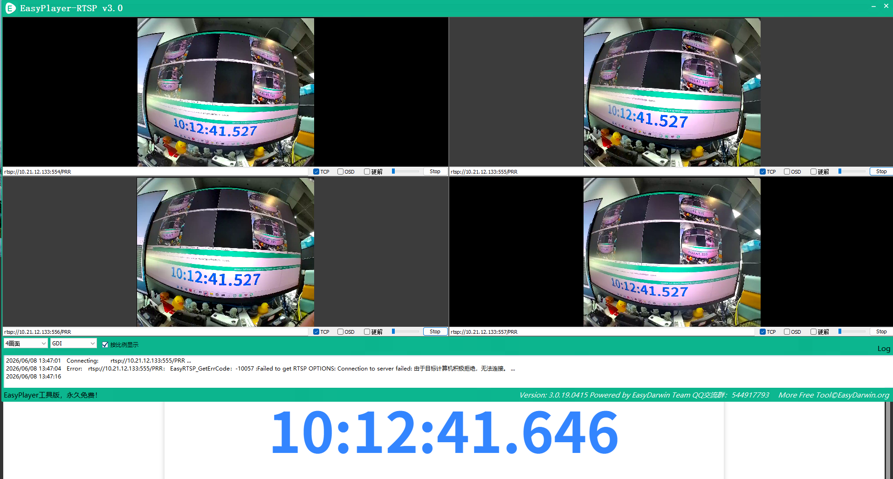
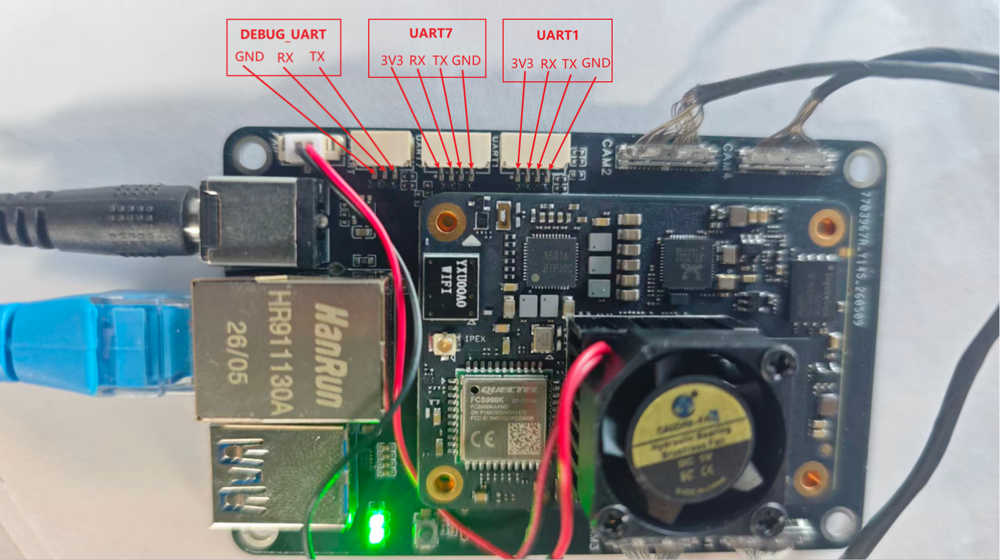

# X5 SC132 4-Camera, IMU And UART Open Source Demo

English version: [README_EN.md](README_EN.md)


这是给用户交付的最小开源 demo。它包含 SC132 四目相机 RTSP 示例、IMU 读取示例、串口通信示例、公开头文件和二进制驱动库，不包含底层驱动实现源码。

## 1. 目录结构

```text
open_source_demo/
├── CMakeLists.txt
├── README.md / README_EN.md
├── demo/                    # 可直接部署到 X5 /root/demo 的运行包
│   ├── cam_demo / sensor_demo / imu_reader_demo / serial_port_demo
│   ├── env.sh / manifest.sha256
│   ├── config/              # sensor_demo YAML 配置
│   ├── bin/                 # AArch64 可执行文件
│   └── lib/                 # 与运行包匹配的三套动态库
├── image/                   # README 接线图片
├── config/                  # sensor_demo 默认 YAML 配置
│   └── sensor_config.yaml
├── include/
│   ├── icm42688_driver.h
│   ├── sc132camera.h
│   └── prrtsp_v2.h
├── lib/                     # 源码交叉构建时链接的交付库
├── scripts/
│   ├── build_cam_demo.sh
│   ├── build_sensor_demo.sh
│   ├── build_imu_reader_demo.sh
│   ├── build_serial_port_demo.sh
│   ├── cam_demo_regression.sh
│   ├── package_runtime.sh
│   └── verify_runtime_package.py
└── src/
    ├── cam_demo.cpp / sensor_demo.cpp
    ├── cam_demo_common.* / cam_demo_config.*
    ├── cam_demo_pipeline.* / cam_demo_rtsp.*
    ├── imu_reader_demo.cpp
    └── serial_port_demo.cpp
```

`cam_demo.cpp` 保留主流程和用户二次开发入口；配置解析、RTSP 封装、帧队列和后台推流流程分别拆到 `cam_demo_config.*`、`cam_demo_rtsp.*`、`cam_demo_pipeline.*`，便于用户按模块阅读。

本公开仓库不包含内部 `tests/` 和发布检查清单。集成到顶层 `4cam` 工作区时，这些维护资产位于主仓库的 `tests/robobaton_4p_demo/`；它们不属于用户源码交付，也不会进入 `demo/` 板端运行包。`build_x5/`、`.package-build-*`、`regression_logs/` 和 Python 缓存均为本地生成物，不属于发布内容。

## 发布仓库与版本关系

本仓的`main`是non-ROS公开发布线。完整V1不是由本仓`main`单独定义，而是由顶层`4cam`主仓`master`通过gitlink同时固定以下三个公开仓提交：

```text
RoboBaton_4p_demo              main
RoboBaton_4P_ROS2_demo         main
4P_doc                         main
```

使用正式交付时，应以发布说明指定的本仓commit/tag和`demo/manifest.sha256`为一组，不要把任意时间拉取的`main`源码与其他版本的预编译库或运行包混用。顶层工程内部的`feature/* -> dev -> rc/* -> master`流程只用于候选晋升；未进入正式组成的dev/feature内容不代表公开支持能力。

## 版本查询

仓库和运行包根目录都包含机器可读的`VERSION`。四个交付程序都支持无需初始化相机、IMU或UART的`--version`：

```bash
cat demo/VERSION
demo/cam_demo --version
demo/sensor_demo --version
demo/imu_reader_demo --version
demo/serial_port_demo --version
```

`cam_demo`和`sensor_demo`还会输出进程实际加载的`libsc132`、`libprrtsp`和`libicm42688`产品版本及ABI版本，用于发现程序与SO混装。三个自研SO分别提供`sc132_get_version()`、`prrtsp_get_version()`和`icm42688_get_version()` C API；返回值是进程静态只读字符串，不得释放。产品SemVer与SO的SONAME/ABI版本相互独立。

功能新增、问题修复和已知限制统一记录在[公开版本更新记录](https://github.com/Hessian-matrix/4P_doc/blob/main/source/changelog.md)中。

## 2. 构建

本 demo 设计为“开发机交叉编译，X5 板端只运行”，不要求也不建议在 X5 板端原生编译。

构建前需要准备：

- X5 aarch64 交叉编译工具链（已包含在配套压缩包中）
- CMake（主机侧工具，**不包含在该压缩包中**，需要单独安装）
- X5 SDK 提供的 toolchain file（已包含在配套压缩包中）

配套编译工具压缩包：https://www.hessian-matrix.com/wp-content/uploads/2026/automaticupdates/x5_4cam_cross_toolchain_20260708.tar.gz

压缩包内已确认包含：

```text
cross_compile/new/toolchain/aarch64_x5_host_toolchain.cmake
cross_compile/new/toolchain/arm-gnu-toolchain-11.3.rel1-x86_64-aarch64-none-linux-gnu/bin/aarch64-none-linux-gnu-gcc
cross_compile/new/toolchain/arm-gnu-toolchain-11.3.rel1-x86_64-aarch64-none-linux-gnu/bin/aarch64-none-linux-gnu-strip
X5 SDK platform_samples、sysroot 和相关头文件/库
```

压缩包不包含主机侧 `cmake` 命令；其中出现的 `cmake/` 目录是 SDK/ROS 包的 CMake 元数据，不是可执行的 CMake 安装。解压后可这样设置 toolchain：

```bash
tar -xzf cross_compile_toolchain/x5_4cam_cross_toolchain_20260708.tar.gz \
  -C cross_compile_toolchain

export X5_TOOLCHAIN_ROOT="$PWD/cross_compile_toolchain/x5_4cam_cross_toolchain_20260708"
export TOOLCHAIN_FILE="$X5_TOOLCHAIN_ROOT/cross_compile/new/toolchain/aarch64_x5_host_toolchain.cmake"
```

然后确认主机另行安装了 CMake：

```bash
cmake --version
```

下面命令中的 toolchain file 路径仅为本机示例，用户需要替换成自己环境里的实际路径：

```bash
cd open_source_demo
cmake -S . -B build_x5 \
  -DCMAKE_TOOLCHAIN_FILE=/path/to/aarch64_x5_host_toolchain.cmake
cmake --build build_x5 -j
```

也可以只编译单个 demo：

```bash
TOOLCHAIN_FILE=/path/to/aarch64_x5_host_toolchain.cmake scripts/build_cam_demo.sh
TOOLCHAIN_FILE=/path/to/aarch64_x5_host_toolchain.cmake scripts/build_sensor_demo.sh
TOOLCHAIN_FILE=/path/to/aarch64_x5_host_toolchain.cmake scripts/build_imu_reader_demo.sh
TOOLCHAIN_FILE=/path/to/aarch64_x5_host_toolchain.cmake scripts/build_serial_port_demo.sh
```


生成文件：

- `build_x5/imu_reader_demo`
- `build_x5/sensor_demo`
- `build_x5/serial_port_demo`
- `build_x5/cam_demo`

检查架构：

```bash
file build_x5/imu_reader_demo
file build_x5/serial_port_demo
file build_x5/cam_demo
file lib/libicm42688.so
file lib/libsc132.so
file lib/libprrtsp.so
```

期望输出包含 `ARM aarch64`。

如果没有交叉编译工具链，则不能重新编译 demo，只能使用已经编译好的 `sensor_demo`、`imu_reader_demo`、`serial_port_demo`、`cam_demo` 和 `lib/` 下对应 `.so` 部署到板端运行。

## 3. 部署

主仓库集成时，`sub_module/RoboBaton_4p_demo/demo/` 是随仓库分发的板端运行包；单独查看本仓库时，对应运行包就是当前仓库的 `demo/`。用户可以直接把 `demo/` 的内容复制到 X5 的 `/root/demo/` 作为更新包。

> 当前仓库状态提示：截至 2026-07-24，`demo/` 已由当前 C ABI v2 源码和三套交付 SO 重新生成，并通过 `scripts/verify_runtime_package.py` 与 `manifest.sha256` 包内一致性校验；四个 demo 均通过 AArch64 构建。最终 `sensor_demo` 板端联合 smoke 取得 12424 个有效 IMU sample、1002.63Hz，invalid/duplicate/regression 均为 0，退出码为 0，板后 GPIO395/417 和 SPI 资源恢复正常。
>
> 2026-07-28新增的frozen `CLOCK_REALTIME-CLOCK_MONOTONIC_RAW` offset、相机/IMU共享`system_realtime` epoch和运行中REALTIME跳变免疫，已完成non-ROS T1/T2/T3/T3.1/T4/T5验收；最终报告见顶层`docs/test/FROZEN_SYSTEM_TIMESTAMP_FINAL_ACCEPTANCE_REPORT.md`，可复用流程见顶层`docs/test/FROZEN_SYSTEM_TIMESTAMP_TEST_RUNBOOK.md`。

代码或动态库变更后，维护者先在开发机重新构建依赖库并刷新 `demo/`：

```bash
cd <4cam-repo-root>/sub_module/RoboBaton_4p_demo
scripts/package_runtime.sh
```

`scripts/package_runtime.sh` 是发布仓 consumer 构建和打包入口：它只从本仓库已经提供的 `./lib` 和 `./include` 读取 producer 运行库与公开头，重新配置并编译本仓库的四个 demo target，最后原子发布并验证 `./demo`。它不会编译 `icm42688_driver.cpp`，也不会访问或依赖主仓库的 producer 源码。

运行包包含顶层启动脚本、`env.sh`、`config/sensor_config.yaml`、`bin/` 和 `lib/`。部署时请完整拷贝 `demo/` 的内容到板端，不要只拷贝单个可执行文件、单个 `.so` 或漏拷配置文件。

部署到 X5：

```bash
ssh root@<x5-ip> "rm -rf /root/demo && mkdir -p /root/demo"
tar -C demo -cf - . | ssh root@<x5-ip> "tar -xf - -C /root/demo"
ssh root@<x5-ip> "chmod +x /root/demo/cam_demo /root/demo/sensor_demo /root/demo/imu_reader_demo /root/demo/serial_port_demo /root/demo/bin/*"
```

注意：这里复制的是 `demo/` 目录里的内容，不是把外层 `demo/` 目录整体复制到板端；板端不应出现 `/root/demo/demo/`。

板端目录结构：

```text
/root/demo/
├── cam_demo
├── sensor_demo
├── imu_reader_demo
├── serial_port_demo
├── env.sh
├── config/
│   └── sensor_config.yaml
├── bin/
│   ├── cam_demo
│   ├── sensor_demo
│   ├── imu_reader_demo
│   └── serial_port_demo
└── lib/
    ├── libicm42688.so
    ├── libsc132.so
    └── libprrtsp.so
```

默认运行方式：

```bash
cd /root/demo
./cam_demo
./imu_reader_demo
./serial_port_demo
```

顶层 `sensor_demo`、`cam_demo`、`imu_reader_demo`、`serial_port_demo` 是启动脚本，会先设置：

```bash
LD_LIBRARY_PATH=/root/demo/lib:/usr/hobot/lib:/usr/hobot/lib/sensor:/usr/lib:/lib64:/lib
```

真实 ELF 在 `bin/` 下。如果要直接运行 `bin/` 下的 ELF，需要先加载环境：

```bash
cd /root/demo
. ./env.sh
./bin/cam_demo
```

四个 demo 都带有默认配置，普通功能验证时：`./sensor_demo`用于联合相机/RTSP和INT1 IMU，`./cam_demo`只用于相机/RTSP，`./imu_reader_demo`用于独立INT1 IMU，`./serial_port_demo`用于串口。需要修改帧率、码率、串口号、采样次数或IMU采样率时，再通过命令行参数覆盖默认值。

`sensor_demo` 启动时先读取 `${DEMO_DIR:-当前目录}/config/sensor_config.yaml`；缺失时自动写入默认配置。该 YAML 使用 `camera`、`rtsp`、`imu` 三个 section，支持 `camera.width`、`camera.height`、`camera.fps`、`camera.rotate`、`rtsp.bps`、`rtsp.codec`、`rtsp.url`、`imu.sample_rate_hz`、`imu.print_rate_hz` 和 `imu.print_metrics`。其中 `camera.width`/`camera.height` 固定为 `1280`/`1088`，仅用于暴露当前分辨率合同，修改会被拒绝；默认 YAML 不再选择相机 mask，完整四目路径固定为 `0xf`，单颗 sensor 诊断请继续使用 `cam_demo --camera-id`。命令行参数优先，只覆盖显式项；`camera_id`、`diagnostics`、`diag_interval_ms`、`max_skew_ns`、`frame_timeout_ms`、`trigger_mode`、`imu_sample_drop_policy` 和 `imu_start_order` 仍为 CLI 配置项。`cam_demo` 不读取该 YAML。

## 4. sensor_demo 联合相机与IMU

`sensor_demo`是联合运行入口：相机仍通过`libsc132.so`和PRRTSP v2输出四路RTSP，IMU通过`libicm42688.so`的GPIO395 DRDY + sensor timestamp FIFO合同连续采集，默认`1000Hz`，可通过`--sample-rate-hz`切换到`25/50/100/200/500/1000/2000Hz`。IMU不使用GPIO397或FSYNC；退出时先停止相机/RTSP，再停止IMU采集线程。

`sensor_demo` 的 IMU 终端记录与 `imu_reader_demo` 使用同一格式：默认按 `min(sample-rate-hz, 10)` 抽样输出 `imu data:` 多行块，`--print-rate-hz HZ` 可调整输出频率，`--print-rate-hz 0` 只保留启动/退出摘要，`--print-metrics` 才追加 `metrics:` 诊断段。

```bash
./sensor_demo
```

```bash
./sensor_demo --sample-rate-hz 2000
```

```bash
./sensor_demo --print-rate-hz 50 --print-metrics
```

退出日志包含：

```text
SENSOR_IMU_RESULT samples=... invalid=... timestamp_duplicates=... timestamp_regressions=... effective_hz=...
```

启动时会先输出 `TIME_BASE realtime_start_ns=... monotonic_raw_start_ns=... frozen_offset_ns=...`。`system_realtime` 输出由启动时冻结的 `CLOCK_REALTIME - CLOCK_MONOTONIC_RAW` offset 外推得到；在 V1 唯一已验证的 `software_gpio` 触发模式下，相机诊断中的 `camera_ts_ns` 和 RTSP PTS 也映射到该 system 时间域。显式使用实验性的 `vin_lpwm` 或 `none` 时保留 SC132 原生时间域，不声明为 V1 wall/realtime 合同。IMU 输出中的 `host_timestamp_ns`/`sample_timestamp_ns` 始终映射到 `system_realtime`。GPIO395 仍是 IMU DRDY 边沿锚点，FIFO TMST 仍决定逐 sample 相对时间；映射只改变 epoch，不用最近邻时间差伪造物理 TD，TD 应在共同运动事件采集后单独估计。

### `sensor_demo` 的 `[FRAME_SET] trigger_sync` 诊断日志

使用 `sensor_demo --diagnostics` 时，SC132 frame-set matcher 可能周期性输出：

```text
[FRAME_SET] trigger_sync matched_total=6961 discarded_total=28 trigger_seq=6989 lag_ns=9728000 interval_max_lag_ns=9738583 limit_ns=16666666
```

字段含义：

| 字段 | 含义 |
|---|---|
| `matched_total` | 当前 frame-set sync 状态 reset 后，成功完成 GPIO trigger/frame-set 匹配的累计次数。 |
| `discarded_total` | 匹配时累计丢弃的过旧或不再使用的 trigger queue entry 数量；不是 RTSP 丢帧计数，也不是 retryable frame-set drop 计数。非零本身不表示失败。 |
| `trigger_seq` | 最新匹配 GPIO417 软件上升沿序号；不是 sensor 硬件 frame ID。 |
| `lag_ns` | 当前 frame-set 最早 frame timestamp 减匹配 GPIO trigger timestamp：`frame_timestamp_ns - trigger_timestamp_ns`。 |
| `interval_max_lag_ns` | 从上一条 `trigger_sync` 报告以来观测到的最大 lag；打印后清零，当前报告周期约 1 秒，不是整个长测的历史最大值。 |
| `limit_ns` | 当前允许的最大 trigger lag。当前默认 30Hz 是 `33333333 ns`；显式 60Hz 示例为 `16666666 ns`，均约一个 frame period。 |

上面显式 60Hz 示例表示：

```text
当前 lag       = 9.728000 ms
区间最大 lag   = 9.738583 ms
允许上限       = 16.666666 ms
当前安全余量   = 6.938666 ms
```

并且本例中：

```text
matched_total + discarded_total = trigger_seq
6961 + 28 = 6989
```

因此这条日志本身表示 matcher 仍在持续工作，lag 也低于一帧门限。判断异常时必须同时检查：

```text
trigger_retryable
no valid GPIO417 trigger timestamp
worker fatal
四路 camera last_seq/fps
四路 RTSP frame count
queue_full_rejects
```

`trigger_sync` 是诊断进度行，不是单独的 PASS/FAIL 结论。只有当它伴随 frame-set 停止、四路 RTSP 停止、retryable burst 超限、结构性 fatal 或 timestamp 错配时，才需要按 T3/T4/T5 runbook 继续归因。


### SC132 四目相机 RTSP Demo

`cam_demo` 演示如何同时使用：

- `libsc132.so`：启动 SC132 四目相机，并通过 frame-set callback 获取配组后的 NV12 DMA 帧
- `libprrtsp.so`：把四路 NV12 帧送入 X5 编码器并输出 RTSP

四个 demo 可执行文件已经按 X5 运行环境链接。请保持 `sensor_demo`、`cam_demo`、`include/` 和 `lib/` 中的二进制库来自同一份运行包；不要混用系统目录或其他工程里的同名 `.so`，否则可能出现启动失败或运行时符号不匹配。

默认运行：

```bash
./cam_demo
```

当前 X5 镜像依赖系统 `cam-service` 初始化 camera/ISP 基线；运行 demo 前先确认该服务存在，不要同时运行多个相机应用：

```bash
/etc/init.d/S90cam-service start 2>/dev/null || true
pgrep -a cam-service
killall -q cam_demo 2>/dev/null || true
```

`--trigger-mode` 默认值是 `software_gpio`，对应当前四目相机外触发接线，也是 V1 唯一已验证的稳定 Trigger 模式。`vin_lpwm` 和 `none` 仍可作为实验性参数显式传入，但尚未验收，不属于 V1 稳定合同。普通交付运行直接执行 `./cam_demo`，默认启动固定四路、30fps、H.264、正装方向 `1280x1088` 输出；执行 `./cam_demo --codec h265` 可切换四路 H.265 推流。

部署时请整目录拷贝 `/root/demo` 运行包。顶层入口会设置 `LD_LIBRARY_PATH`，如果只拷贝 `bin/cam_demo` 或单个 `.so`，板端可能加载系统库，导致运行环境和交付包不一致。

常用参数：

```text
--width <pixels>   图像宽度，默认 1280
--height <pixels>  图像高度，默认 1088
--fps <25|30|40|50|60> 相机和编码帧率，默认 30；25/30/40/50 为 V1 稳定功能配置；60 为显式 stress-only 压力配置
--codec <h264|h265> 编码格式，默认 h264
--rotate <0|90|180|270> 输出旋转角度，默认 0；180 仅支持 30fps，不支持 25/40/50/60fps
--bps <kbps>       编码目标平均码率，单位 kbps，默认 4000；可按带宽/画质折中覆盖
--url <path>       RTSP path，默认 /PRR
--trigger-mode <software_gpio|vin_lpwm|none> 触发输出模式，默认 software_gpio/GPIO417
--diagnostics      输出每路送帧耗时和时间戳 skew 诊断信息
--max-skew-ns <ns> 帧组 timestamp skew 放行上限，默认 2000000；同步配组后四路 frame_id 对外保持绝对一致
--frame-timeout-ms <ms> 帧组等待缺路帧的超时时间，默认 100
```

限制说明：默认 `./cam_demo` 使用固定四路、30fps、H.264、正装方向 `1280x1088` 输出。`--fps 25/30/40/50` 是 V1 稳定功能配置；`--fps 60` 是显式 `stress-only` 压力配置，不是稳定发布 profile。`--codec h265` 使用相同的四路端口和 path。`--rotate 180` 仅支持 30fps 降载模式，不支持 25/40/50/60fps。RTSP 编码画布随对外旋转角同步变化：`0/180 => 1280x1088`，`90/270 => 1088x1280`；90/270 度不能继续沿用横屏画布。

### H.265 客户端播放说明

`--codec h265` 的板端编码和 RTSP 接口已经完成，可输出固定四路 H.265 码流。在显式 `stress-only` 的四路 `1280x1088@60fps` 配置下同时播放时，部分客户端可能因 H.265 接收、软件解码或渲染吞吐不足而出现卡顿；这不等同于板端编码或 RTSP 发送失败。

排查时应同时观察板端和客户端：

- 如果板端日志中四路 `fps` 接近目标值、`queue_full_rejects=0`，并且 `ffprobe`/`ffmpeg` 能持续接收 `hevc` 码流，则卡顿更可能位于客户端缓冲、解码或显示链路。
- 客户端应优先使用支持 H.265 硬件解码的播放器，并确认硬解实际启用；旧播放器或纯软件解码可能无法处理四路 60fps 压力配置。
- 如果客户端仍无法实时播放，可将 `--fps` 降为 `25/30/40/50` 中的较低档、减少同时播放的通道数，或降低输出分辨率。降低 `--bps` 主要减少传输带宽，通常不能按相同比例降低解码和渲染负荷。
- H.264 与 H.265 配置相同的 `--bps` 时，目标平均码率和网络带宽基本相近；H.265 的优势是相同画质下可选用更低目标码率，而不是在相同码率目标下自动减少带宽。实际带宽受码控、GOP/I 帧峰值及 RTP/RTSP/TCP/IP 开销影响，应以每路实测 `bytes/s` 为准。

因此，验收 H.265 接口时应分别确认“板端持续输出有效码流”和“目标客户端能够实时解码显示”，不要只凭单一播放器的画面流畅度判断板端接口状态。

默认四路 RTSP 地址：

```text
rtsp://<x5-ip>:554/PRR
rtsp://<x5-ip>:555/PRR
rtsp://<x5-ip>:556/PRR
rtsp://<x5-ip>:557/PRR
```

默认 RTSP 端口固定为 `554/555/556/557`。camera 0/1/2/3 分别对应四路输出，交付例程不提供端口重映射参数。

### 4.1 硬件检测：单颗 sensor 取图

当四目整体启动失败、某一路无图、怀疑 FPC/接口/I2C/MIPI 连接异常时，可以只启动单颗 sensor 做硬件排查。该模式只用于检测单颗 sensor 和连接状态；正常运行仍直接执行 `./cam_demo` 启动四路。

测试前先停止其他相机进程：

```bash
cd /root/demo
killall -q cam_demo 2>/dev/null || true
/etc/init.d/S90cam-service start 2>/dev/null || true
```

板端按物理 camera id 启动单颗 sensor：

```bash
./cam_demo --camera-id 0 --diagnostics   # cam0 -> rtsp://<x5-ip>:554/PRR
./cam_demo --camera-id 1 --diagnostics   # cam1 -> rtsp://<x5-ip>:555/PRR
./cam_demo --camera-id 2 --diagnostics   # cam2 -> rtsp://<x5-ip>:556/PRR
./cam_demo --camera-id 3 --diagnostics   # cam3 -> rtsp://<x5-ip>:557/PRR
```

每次只运行一个 `cam_demo`。切换到下一颗 sensor 前，先按 `Ctrl-C` 退出当前进程，或执行：

```bash
killall -q cam_demo 2>/dev/null || true
```

开发机用 `ffprobe` 或播放器拉流确认是否出图；下面以 cam0 为例，其他 sensor 替换端口 `555/556/557`：

```bash
ffprobe -v error -rtsp_transport tcp \
  -select_streams v:0 \
  -show_entries stream=codec_name,width,height,avg_frame_rate \
  -of default=noprint_wrappers=1 \
  rtsp://<x5-ip>:554/PRR
```

正常输出应包含：

```text
# 默认 ./cam_demo
codec_name=h264

# ./cam_demo --codec h265
codec_name=hevc

width=1280
height=1088
avg_frame_rate=30/1
```

判定建议：

- 板端日志出现 `Found sensor_name:sc132gs-1280p`，且 `ffprobe` 能按所选格式读到 `h264` 或 `hevc` 码流，说明该 sensor、I2C、MIPI/VIN 和 RTSP 链路基本正常。
- 只有某个 `--camera-id` 失败时，优先检查对应 camera 接口、FPC、供电和连接方向。
- 四颗单独都能出图但默认四路失败时，优先检查四路同步触发、GPIO417 外触发线、`cam-service` 状态和是否有其他相机进程占用资源。

单颗诊断模式只支持 `--camera-id 0/1/2/3`；不要用该模式判断 2 路或 3 路组合能力。

相机回调后的处理流程：

1. `cam_demo` 通过 `libsc132.so` 的 frame-set API 注册四目同步 callback。
2. `libsc132.so` 对四路相机帧做同步配组，配组成功后回调给 demo。
3. demo 在帧组回调里调用用户入口，并给每路 frame `retain` 后放入对应 RTSP 队列。
4. 队列满时回调不等待、不覆盖旧帧；当前帧拒收入队并触发整条流水线失败关闭。
5. 后台线程从队列取帧，构造 `prrtsp_nv12_frame_v2` 并调用 `prrtsp_stream_send()` 推流。
6. 后台线程处理完成后调用 `sc132_frame_release()` 归还帧。

用户二次开发的四目同步入口在 `src/cam_demo.cpp` 的 `OnSynchronizedFrameSet()`。该函数收到的是同一个 `group_id` 下的四路帧，包含 `max_skew_ns`、每路 `camera_id`、`sequence`、`frame_id` 和 `timestamp_ns`；`libsc132.so` 仅在归一化 `frame_id` 一致且 timestamp skew 不超过配置上限时放行，默认上限 `2000000 ns` 覆盖 30fps 板端实测约 `1.06 ms` 的同帧链路相位差，同时仍远小于一帧周期。不要把裸指针保存到更长生命周期；如果要异步使用图像，请自行 `sc132_frame_retain()`，处理完成后 `sc132_frame_release()`。

日志字段：

- `seq`：每个相机通道独立递增的软件序号
- `group_id`：`libsc132.so` 生成的四目同步帧组序号
- `group_skew_ns`：当前帧组四路 timestamp 最大差值，单位 `ns`，用于诊断链路相位差
- `frame_id`：同步帧组帧号；同一 `group_id` 下四路该值必须完全一致
- `camera_ts_ns`：相机帧时间戳，单位 `ns`。在 V1 唯一已验证的默认 `software_gpio/GPIO417` 模式下，它是匹配到的 GPIO trigger 时间经过 frozen offset 映射后的 `system_realtime` 时间；实验性的 `vin_lpwm`/`none` 优先使用 sensor/VIO 随帧时间戳，缺失时 fallback 为系统出帧时间，不声明为 V1 wall/realtime 合同。
- `enqueue_timestamp_ns`：入队时 host steady clock 时间戳，单位 `ns`
- `queue_full_rejects`：回调发现单路队列已满而拒收帧的累计次数；稳定推流时必须始终为 `0`，任意非零值都会触发失败关闭
- `pipeline_delay_ms`：当前帧从入队到完成 RTSP 送帧调用的耗时
- `send_avg_ms` / `send_max_ms`：开启 `--diagnostics` 后输出，表示统计周期内 `prrtsp_stream_send()` 调用耗时
- `rtsp_latest_skew_ms`：开启 `--diagnostics` 后输出，表示四路最近一次送出的相机时间戳最大差值

### ICM ABI v2边界

ICM发布身份继续保持ABI v2、`libicm42688.so.2`和`ICM42688_X5_2.0`。当前只支持`ICM42688_READ_MODE_SENSOR_TIMESTAMP_FIFO=0`、watermark 1和文档列出的ODR；旧`DIRECT=1`、旧`FIFO`枚举名、DIRECT寄存器读取路径及watermark 8已删除，不提供兼容shim。保持v2只表示导出函数、结构布局和ELF身份保持，不表示旧DIRECT配置可继续运行。当前header、SO和non-ROS demo必须成套部署，不要把该SO单独替换到未迁移程序；ROS2不在本轮范围。

完整决策见顶层`docs/decisions/2026-07-28-icm-v2-sensor-timestamp-fifo-only.md`。

## 5. IMU 读取 Demo

默认运行：

```bash
./imu_reader_demo
```

示例：

```bash
./imu_reader_demo --sample-rate-hz 2000 --count 10000
```

支持的IMU采样率为 `25/50/100/200/500/1000/2000Hz`；默认仍为 `1000Hz`。

终端默认以 `10Hz` 输出，但程序仍消费并计入全部 IMU 样本。可显式设置
`--print-rate-hz` 调整输出频率，该值必须不超过 `--sample-rate-hz`；显式设置为 `0`
时禁用终端输出，`--count` 语义不变。默认只输出 `imu data:` 数据段；加
`--print-metrics` 后才输出 `metrics:` 指标段。

每个已抽样 IMU 样本输出一个带边界的多行记录。分割符
`*****************************************************************` 始终输出；默认格式为：

```text
*******************************IMU*******************************
imu data:
sample_seq=20400
ts_ns=1785426031483224328
temp_c=40.942029 accel_norm_mps2=9.513199
accel_mps2=[-0.100556, 3.586514, -8.810662]
gyro_rps  =[-0.003193, 0.009578, -0.013835]
*****************************************************************
```

数据段字段：

- `sample_seq`：IMU 样本序号
- `ts_ns`：映射到 `system_realtime` epoch 的 IMU sample 时间戳，单位 `ns`；它由 `CLOCK_MONOTONIC_RAW` 域 FIFO TMST 时间加启动冻结 offset 得到
- `temp_c`：温度，单位 `degC`
- `accel_norm_mps2`：三轴加速度模长，静止时通常接近 `9.81`
- `accel_mps2`：三轴加速度，单位 `m/s^2`
- `gyro_rps`：三轴角速度，单位 `rad/s`

加 `--print-metrics` 后，每条记录会在最终分割符前追加指标段：

```text
metrics:
host_ts_ns=1785426031488200044
host_ts_gap_ms=4.975716 dt_ms=99.700735 uncertainty_us=65
gpio_gap_count=0 fifo_overflow_count=0 mapper_failure_count=0
```

指标段字段：

- `host_ts_ns`：映射到 `system_realtime` epoch 的 GPIO395 DRDY 边沿锚点，单位 `ns`
- `host_ts_gap_ms`：`host_ts_ns - ts_ns`，单位 `ms`，用于观察 GPIO 边沿锚点和 sample 时间戳的映射间隔
- `dt_ms`：相邻两个已输出样本的 `ts_ns` 差，单位 `ms`；默认 10Hz 输出时通常约为 `100ms`，非零显式输出频率下约为 `1000 / --print-rate-hz` ms；`--print-rate-hz 0` 不产生逐帧 `dt_ms`
- `uncertainty_us` / `gpio_gap_count` / `fifo_overflow_count` / `mapper_failure_count`：时间戳映射、GPIO 事件间隔、FIFO 溢出和 mapper 失败计数诊断

说明：

- demo 使用GPIO395 DRDY + sensor timestamp FIFO模式（`ICM42688_READ_MODE_SENSOR_TIMESTAMP_FIFO`）
- `host_timestamp_ns` 记录 GPIO395 rising edge 锚点，`sample_timestamp_ns` 由 FIFO 内 TMST 映射得到逐 sample 时间戳；demo 对外打印前用同一个 `TIME_BASE` 冻结 offset 将二者转换为 `system_realtime`
- IMU 路径不使用 GPIO397、FSYNC 或 `icm42688_pulse_fsync()`
- 驱动 callback 运行在采集线程且只负责将样本送入 64 槽有界 FIFO；自定义 observer 与 CLI 输出均在 owner 线程执行
- CLI 输出对每条多行记录执行一次非阻塞 write；SSH、pipe 或日志收集器变慢/关闭时只丢弃 CLI 记录，owner 仍持续消费全部 IMU 样本
- 默认 10Hz 进一步降低正常终端的文本量；可显式提高 `--print-rate-hz` 做诊断，但慢 sink 下输出日志不保证完整
- 若自定义 observer 的平均处理时间超过采样周期等 owner 计算路径持续变慢，64 槽 FIFO 仍按设计 fail-closed，禁止静默丢 IMU 样本

## 6. 串口通信 Demo

接口线序如下：


三组 UART 的 TX/RX 信号逻辑电平均为 `3.3V`。按上图板卡顶视图从左到右，`DEBUG_UART` 为 `GND/RX/TX`，`UART7` 和 `UART1` 为 `3V3/RX/TX/GND`；图片没有标出 Pin 1，从线缆端或连接器插接面观察时不要直接照抄左右顺序。接线必须共地，禁止接入 5V TTL、RS-232 或 USB-UART VCC；`3V3` 引脚的供电方向、允许电流和热插拔能力不属于 V1 合同。

V1 只交付 `serial_port_demo` 软件示例；UART 实际硬件通信、外接线束、USB-UART 适配器和对端设备尚未纳入 V1 验收。

默认运行：

```bash
./serial_port_demo
```

默认配置使用 `/dev/ttyS1`、`115200`、`txrx` 模式。需要指定端口或模式时再增加参数，例如：

```bash
./serial_port_demo --port /dev/ttyS1 --mode tx --baud 115200 --text "hello-x5"
./serial_port_demo --port /dev/ttyS7 --mode rx --baud 115200
./serial_port_demo --port /dev/ttyS1 --mode txrx --baud 115200 --count 10 --text "ping"
./serial_port_demo --port /dev/ttyS7 --mode echo --baud 115200
```

常用参数：

```text
--port <path>             串口设备，默认 /dev/ttyS1
--baud <rate>             波特率，默认 115200
--mode <tx|rx|txrx|echo>  模式，默认 txrx
--count <n>               tx/txrx 表示发送次数，rx/echo 表示接收包数，0 表示持续运行
--interval-ms <ms>        发送间隔，默认 1000
--timeout-ms <ms>         接收超时，默认 200
--text <str>              发送文本前缀，默认 uart-demo
--no-newline              发送数据末尾不追加换行
```

## 7. 部署后快速验证

部署完成后，建议先确认四个 demo 都能启动帮助信息：

```bash
cd /root/demo
./cam_demo --help
./imu_reader_demo --help
./serial_port_demo --help
./sensor_demo --help
```

相机 demo 验证流程：

```bash
cd /root/demo
/etc/init.d/S90cam-service start 2>/dev/null || true
pgrep -a cam-service
./cam_demo
```

启动成功后，用播放器或 RTSP 客户端打开：

```text
rtsp://<x5-ip>:554/PRR
rtsp://<x5-ip>:555/PRR
rtsp://<x5-ip>:556/PRR
rtsp://<x5-ip>:557/PRR
```

基本通过标准：

- 四个 RTSP 地址都能连接并持续出图。
- 四路画面无黑屏、无明显花屏、无明显冻结。
- 日志中四路 `fps` 长期接近目标帧率。
- 日志中 `queue_full_rejects` 保持为 `0`。
- 不出现明显错误、崩溃或相机反复重启。

30fps 自动运行回归脚本不属于 `/root/demo` 运行包；它是开发机源码仓库中的 SSH 驱动工具。脚本会从开发机向四个端口发送 RTSP `OPTIONS`，并检查四路编码初始化、帧率、同步指标和干净退出。先把 `demo/` 完整部署到板端 `/root/demo`，再在开发机的 `4cam` 仓库根目录执行：

```bash
cd <4cam-repo-root>
sub_module/RoboBaton_4p_demo/scripts/cam_demo_regression.sh \
  --host <x5-ip> \
  --fps 30 \
  --min-fps 28 \
  --max-group-skew-ns 2000000 \
  --kill-existing
```

不要在板端 `/root/demo` 中执行 `scripts/cam_demo_regression.sh`；运行包只包含 `bin/`、`lib/`、`config/sensor_config.yaml`、顶层启动脚本 `sensor_demo`、`cam_demo`、`imu_reader_demo`、`serial_port_demo`，以及 `env.sh` 和 `manifest.sha256`。

`OPTIONS` 只能证明 RTSP 控制面可达，不能替代码流解码验收。正式交付仍需按本节前述四个 URL 各连接一个实际客户端，确认四路都能持续解码出图；单个端口一次只连接一个客户端，避免探测客户端占用该端口的会话槽。

## 8. 运行约束

IMU demo 默认使用当前 X5 主板连接：

- SPI 设备节点：`/dev/spidev2.0`
- SPI mode：`0`
- SPI speed：`4 MHz`
- 默认读取模式：sensor-timestamp FIFO

串口 demo 只提供软件示例。用户需要根据上面的 3.3V pinout 和现场接线选择 `/dev/ttyS1`、`/dev/ttyS7` 或其他串口设备；实际 UART 收发不属于 V1 已验收功能。

SC132 相机 demo 依赖 X5 板端 camera/vpf/hbmem/multimedia/FFmpeg/OpenSSL 等系统运行库，只适合在 X5 板端运行。开发机只用于交叉编译。

## 9. 常见问题

### 9.1 找不到 `.so`

确认目标目录是：

```text
/root/demo/
├── sensor_demo / cam_demo / imu_reader_demo / serial_port_demo
├── env.sh
├── config/
│   └── sensor_config.yaml
├── bin/
│   ├── sensor_demo
│   ├── cam_demo
│   ├── imu_reader_demo
│   └── serial_port_demo
└── lib/
    ├── libicm42688.so
    ├── libsc132.so
    └── libprrtsp.so
```

默认通过顶层脚本运行时会自动设置 `LD_LIBRARY_PATH`。如果直接运行 `bin/` 下的 ELF，先执行：

```bash
cd /root/demo
. ./env.sh
./bin/imu_reader_demo
```

### 9.2 IMU 启动失败

检查：

```bash
ls -l /dev/spidev2.0
./imu_reader_demo
```

常见原因：

- `/dev/spidev2.0` 不存在
- SPI 管脚被其他服务占用
- IMU 供电、焊接或设备树配置异常

### 9.3 串口没有数据

检查：

```bash
ls -l /dev/ttyS1 /dev/ttyS7
./serial_port_demo
```

常见原因：

- 端口选错
- 波特率不一致
- TX/RX 线序错误
- 对端没有发送数据

### 9.4 相机或 RTSP 启动失败

检查：

```bash
ls -l lib/libsc132.so lib/libprrtsp.so
. ./env.sh
ldd ./bin/cam_demo
./cam_demo
```

常见原因：

- SC132 四目相机硬件未连接或供电异常
- X5 设备树 / camera sensor profile 不匹配
- X5 multimedia 运行库缺失或版本不匹配
- `LD_LIBRARY_PATH` 未包含当前目录 `lib/`，或 `ldd ./bin/cam_demo` 没有优先加载本目录 `lib/libsc132.so` / `lib/libprrtsp.so`
- 系统 `cam-service` 未运行或状态异常；先执行 `/etc/init.d/S90cam-service start`
- 另一个相机应用仍在运行，占用了 camera/VIO 资源
- 默认 RTSP 端口 `554/555/556/557` 被其他进程占用
- 当前网络无法从开发机访问 X5 RTSP 端口

本 demo 面向固定四目运行，不提供 2 路或 3 路部分启动模式。

如果需要确认相机采集、队列或 RTSP 送帧是否存在延迟，可以临时使用：

```bash
./cam_demo --diagnostics
```

判断依据：

- 如果应用日志里的 `fps` 接近配置目标（默认约 30）、`queue_full_rejects=0`，但播放器某一路明显慢，问题更可能在 RTSP 客户端缓冲或播放器显示链路。
- 如果 `send_max_ms` 长时间异常升高，再继续排查对应 RTSP 或编码链路。
- 如果 `group_skew_ns` 长期接近一个帧周期，继续检查外触发、相机启动顺序和板端负载。
